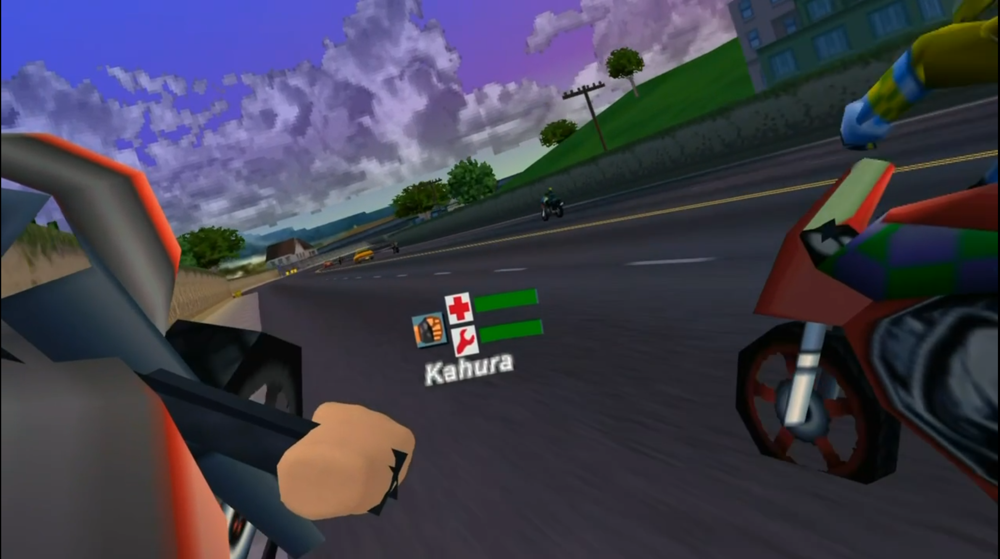

# Road Rash: Jailbreak PC & VR - 0.1.0

A native Windows reimplementation of **Road Rash: Jailbreak** (PlayStation, 2000): its own engine,
OpenGL renderer and game loop, with the game's code ported function by function from the original MIPS
executable and checked against it. The game reads its assets from **your own disc image**; no game data,
BIOS or saves are included.

Release 0.1.0 includes the Windows desktop game, Windows PCVR through OpenXR and Quest 3 standalone VR:
the original front end (title, menus, career, memory-card saves), races with the ported bike physics,
AI, combat, police, traffic and sound. The player ZIP contains the prebuilt tools, OpenXR loader and
Quest APK. The source kit contains the code and build scripts. See [validation](docs/VALIDATION.md)
for automated checks and the remaining headset play checks.



| Version | Where the game runs | Install | Launch | State |
|---|---|---|---|---|
| **Windows PC (flat / monitor)** | On your PC | `INSTALL.bat` (source) or `INSTALL-PC.bat` (player package) | `PLAY.bat` | playable |
| **Windows PCVR (OpenXR)** | On your PC, shown in your headset | `INSTALL-PCVR.bat` (player package) | `PLAY-PCVR-STEAMVR.bat`, `PLAY-PCVR-META.bat` or `PLAY-PCVR-VD.bat` | included |
| **Quest 3 standalone VR** | On the headset | `INSTALL.bat` (player package) | **Road Rash VR** under **Unknown Sources** | included |

The PLAY launchers are created in your installed game folder. See [CHANGELOG.md](CHANGELOG.md).

## Supported disc

| Disc | Volume | Executable | Executable SHA-1 |
|---|---|---|---|
| Road Rash: Jailbreak (USA) | `SLUS_01053` | `SLUS_010.53` | `67ed165a2c517d4e6106fb0dfa324d66dd9a76f1` |

The installer also checks the three overlays: `RASHCDF.BIN` `a3fec4b4e9292c358d0f6dc529843f5d8f25924a`,
`RASHCDG.BIN` `cfe43a7786759f2cb9c57751cf99e84d1074782c`, `RASHCDI.BIN` `9a8b79d8739713c12b0a2dc4d75ef8f0a2cc0b06`.
The disc is identified by these hashes, read through the game's own disc reader
(`rrtool identify <image>`), never by the file name. European and other releases are not supported yet
and are rejected with the hash that differs.

Accepted inputs: a single-track raw **MODE2/2352 BIN/CUE** dump (select the `.bin` or the `.cue`), or a
`.zip` / `.7z` holding one such `.bin`. A 2048-byte `.iso` omits the XA sectors the game streams and is
rejected. The installer copies the image into the game folder (`runtime\disc\`) and never modifies your
original. It never downloads game images.

## Install on Windows PC

From the source kit: run **INSTALL.bat**. It installs missing build tools through WinGet (CMake, Ninja,
Visual Studio 2022 Build Tools with the C++ workload), builds the game, asks for your disc image,
identifies it, copies it into the game folder, checks the copy byte for byte, runs the disc self-checks
(models, road network, scene cells) and starts the game once, hidden and silent, to prove it finds the
installed disc. The game folder is `install\` inside the source folder unless you pass `-InstallDir`.

Then start **PLAY.bat** in the game folder, or **rrgame.exe** directly. See
[player installation](docs/PLAYER-INSTALL.md) for the prebuilt player package.

rrgame finds the disc in this order: a path on its command line; `disc.txt` next to `rrgame.exe` (one
line, the path of your image; relative paths are relative to the exe); `runtime\disc\*.bin`;
`disc\*.bin`. Saves and settings live in `saves\` next to `rrgame.exe` (`saves\rrjb_card.mcr`, a raw
128 KiB PlayStation memory card image). A card from an earlier build (`rrjb_card.mcr` next to the exe)
is copied there on first start and the old file is kept.

## Optional HD media

**PREPARE-HD.bat** (also offered at the end of the installation) makes an HD pack on your PC from your own disc: the
menus' pictures, the loading screens and the films enlarged 4x by a neural upscaler (Real-ESRGAN, which you install
yourself - the scripts never download it), the fonts and the race HUD as 4x contour atlases that keep the game's live
palettes. The game uses it when **HD textures and media** is on (F10 > Image quality, or the VR menu > Graphics).
Nothing of it ships with the game. See [HD media](docs/HD-MEDIA.md).

## PCVR and Quest

**PCVR**: `INSTALL-PCVR.bat` prepares the same game folder; `PLAY-PCVR-META.bat` (Meta Quest Link / Air
Link), `PLAY-PCVR-STEAMVR.bat` (SteamVR / Steam Link) and `PLAY-PCVR-VD.bat` (Virtual Desktop, VDXR)
start `rrgame.exe --vr` with that OpenXR runtime selected for the game process only. `PLAY-PCVR.bat`
uses the system default. See [PCVR](docs/PCVR.md).

**Quest 3**: `INSTALL.bat` in the player package installs the APK over USB (ADB), copies your disc
image to the app's folder on the headset and verifies it by SHA-1. It does not start the game. Saves
move between PC and Quest with `TRANSFER_PC_SAVES_TO_QUEST.bat` / `TRANSFER_QUEST_SAVES_TO_PC.bat`.
See [Quest](docs/QUEST.md).

## Controls (desktop)

Race: arrows or **W A S D** - Up throttle, Down brake, Left/Right steer; **Z** punch / swing (R1),
**X** L1 action, **Q** kick (R2), **R** / **F** with Z/X/Q for the other combat moves; **C** camera,
**V** look back; **Enter / Esc / P** pause menu (Resume / Quit / Restart). **F2** 4:3 with bars or
widescreen, **F3** dither, **F4** 15-bit / 24-bit colour, **F5** analog pad mode.

Menus: arrows move and change values, **Enter** = Cross (confirm), **Esc / Backspace** = Triangle
(back), **O** = Square, **H** = Circle.

Gamepad (XInput, else any WinMM / DirectInput controller), by PlayStation position: Cross / A
throttle (also the right trigger), Square / X brake (also the left trigger), d-pad or left stick steer,
Circle / B look back, Select / Back camera, Start pause. `rrgame --keys` prints the full list.

## Build from source

Requirements: Windows 10/11 x64, Visual Studio 2022 (or its Build Tools) with the C++ workload, CMake
3.24+, Ninja. OpenGL 3.3 at run time.

```powershell
.\scripts\install.ps1 -DiscImage 'D:\Discs\Road Rash - Jailbreak (USA).cue'
cmd /c build.cmd build
.\build\rrtool.exe identify 'D:\Discs\Road Rash - Jailbreak (USA).bin'
.\build\rrgame.exe 'D:\Discs\Road Rash - Jailbreak (USA).bin'
```

`-InstallDir`, `-BuildDir`, `-SkipDependencies`, `-NoBuild` and `-SkipLaunchCheck` support custom or
offline installs; `-RunGates` also runs `tests\run_gates.ps1 -Quick` (developers only: many gates need
local research captures under `work\`). Reinstalling keeps the previous disc and executables in
`backup-*\` and never touches `saves\`.

## Validation

`tests\run_gates.ps1` is the project's acceptance run: every ported function is compared bit for bit
with the original code running in the project's own R3000 + GTE interpreter (a development oracle only,
never part of the game), plus parser, renderer and game checks, each with negative controls. See
[validation](docs/VALIDATION.md).

The source kit is audited before publication: `scripts\audit-source.ps1` rejects disc images, game
files, BIOS, memory cards, RAM dumps, screenshots, executables, keys, extracted tables and decompiled
code, and development-process text. `scripts\package-source.ps1` exports the kit with a SHA-256 manifest (`SOURCE-MANIFEST.json`).

## License

Project code is available under the [MIT License](LICENSE). You may use, modify and redistribute it,
including commercially, provided that you retain the copyright and permission notice. Credit as
**Road Rash: Jailbreak PC & VR contributors**. Third-party components retain their own licenses; see
[THIRD_PARTY.md](THIRD_PARTY.md). The MIT license does not grant rights to Road Rash game data, Sony
firmware, trademarks or extracted assets. Road Rash is a trademark of Electronic Arts; this project is
not affiliated with or endorsed by Electronic Arts or Sony Interactive Entertainment.
